<!--
  ┌─────────────────────────────────────────────────────────────────────────┐
  │  KANISH PAUL — github.com/kpaul-create                                  │
  │  Terminal-style profile README                                           │
  │                                                                          │
  │  TO CUSTOMISE:                                                           │
  │    1. Drop your ASCII portrait GIF into assets/ascii.gif                │
  │    2. Update scripts/make_info_card.py LINES[] with your info           │
  │    3. Update the Projects section below with real repo links             │
  │    4. Deploy game/ to GitHub Pages (Settings → Pages → /game branch)   │
  │       then update the NEURAL.EXE link href below                        │
  └─────────────────────────────────────────────────────────────────────────┘
-->

<div align="center">

```
_  __              _     _       ____             _
| |/ /__ _ _ __   (_)___| |__   |  _ \ __ _ _   _| |
| ' // _` | '_ \  | / __| '_ \  | |_) / _` | | | | |
| . \ (_| | | | | | \__ \ | | | |  __/ (_| | |_| | |
|_|\_\__,_|_| |_| |_|___/_| |_| |_|   \__,_|\__,_|_|
```

**Web development / AI·ML**&nbsp;&nbsp;·&nbsp;&nbsp;*building things to understand them.*

</div>

---

```
kanish@github:~$ whoami
```

<table>
<tr>
<td valign="top" width="370">

<!-- ── ASCII PORTRAIT ──────────────────────────────────────────────────── -->
<!-- Drop your animated GIF into assets/ascii.gif                          -->
<!-- If you don't have one yet, remove this cell or use a placeholder      -->


</td>
<td valign="top" width="490">

<!-- ── NEOFETCH INFO CARD ─────────────────────────────────────────────── -->
<!-- Auto-generated by: python scripts/make_info_card.py                  -->


</td>
</tr>
</table>

---

```
kanish@github:~$ git activity
```

<!-- ── CONTRIBUTION HEATMAP ────────────────────────────────────────────── -->
<!-- Auto-generated daily by GitHub Actions                                -->
<!-- Manually: python scripts/fetch_contributions.py                      -->
<!--           python scripts/render_heatmap_svg.py                       -->



---

```
kanish@github:~$ ls projects
```

```
01  AXI                  ·  https://github.com/Kpaul-create/axi
02  AI / Computer Vision ·  https://github.com/Kpaul-create/RuView
03  Robotics             ·  https://github.com/Kpaul-create/kanish-paul-s-digital-lair
04  Experimental Systems ·  https://github.com/Kpaul-create/chess-laya
```

<!-- ── PROJECT TABLE ────────────────────────────────────────────────────── -->
<!-- Replace each href and description with your actual repositories       -->

<table>
<tr>
<td width="50" align="center"><code>01</code></td>
<td><b><a href="https://github.com/Kpaul-create/axi">AXI</a></b></td>
<td><code><!-- short description --></code></td>
</tr>
<tr>
<td align="center"><code>02</code></td>
<td><b><a href="https://github.com/Kpaul-create/RuView">AI / Computer Vision</a></b></td>
<td><code><!-- short description --></code></td>
</tr>
<tr>
<td align="center"><code>03</code></td>
<td><b><a href="https://github.com/Kpaul-create/kanish-paul-s-digital-lair">Robotics</a></b></td>
<td><code><!-- short description --></code></td>
</tr>
<tr>
<td align="center"><code>04</code></td>
<td><b><a href="https://github.com/Kpaul-create/chess-laya">Experimental Systems</a></b></td>
<td><code><!-- short description --></code></td>
</tr>
</table>

---

```
kanish@github:~$ ./neural.exe
```

<!-- ── NEURAL.EXE PREVIEW ──────────────────────────────────────────────── -->
<!-- The SVG animates a terminal boot sequence on load.                    -->
<!-- Clicking it opens the actual game on GitHub Pages.                   -->
<!-- After deploying game/ to Pages, replace the href below.              -->

<div align="center">

<a href="https://kpaul-create.github.io/kpaul-create/">
  
</a>

<sub><code>&gt; ENTER SYSTEM</code>&nbsp;&nbsp;·&nbsp;&nbsp;<a href="https://kpaul-create.github.io/kpaul-create/">play NEURAL.EXE ↗</a></sub>

</div>

---

```
kanish@github:~$ cat stack
```

```
Python · PyTorch · TensorFlow · scikit-learn · NumPy · Pandas
Java · JavaScript · React · Next.js · Node.js
Docker · Linux · Nginx · Git
MySQL · MongoDB · Redis
C · C++ · Kotlin
```

---

```
kanish@github:~$ find ./links
```

<table>
<tr>
<td><a href="https://linkedin.com/in/kpaul0011"><code>LinkedIn</code></a></td>
<td><a href="https://twitter.com/thek_paul"><code>X / Twitter</code></a></td>
<td><a href="https://www.leetcode.com/user5741cw"><code>LeetCode</code></a></td>
<td><a href="https://auth.geeksforgeeks.org/user/profile/kanishpauraqc"><code>GeeksForGeeks</code></a></td>
</tr>
<tr>
<td><a href="https://codepen.io/kpaul-create"><code>CodePen</code></a></td>
<td><a href="https://instagram.com/the.k_paul"><code>Instagram</code></a></td>
<td><a href="https://www.youtube.com/c/iq_testyt"><code>YouTube</code></a></td>
<td><a href="mailto:the.kanishpaul@gmail.com"><code>Email</code></a></td>
</tr>
</table>

---

```
kanish@github:~$ _
```
